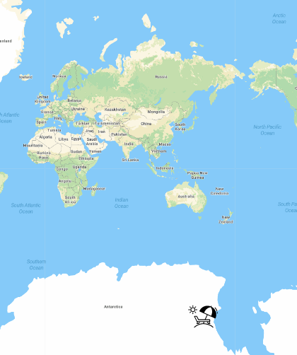
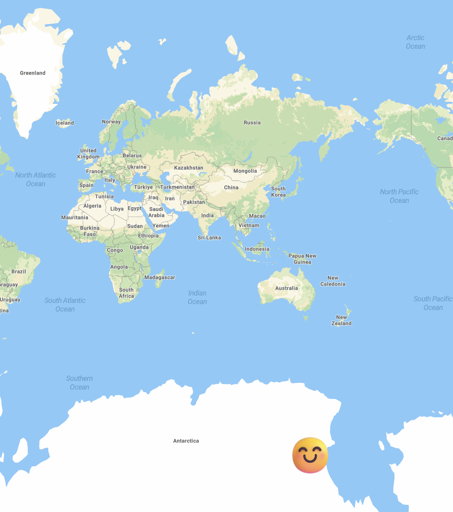
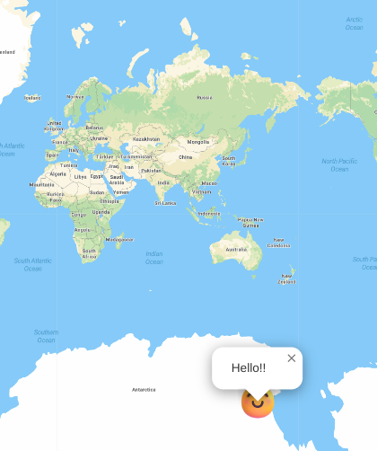

# Entry 2
##### 12/12/22

To start tinkering with leaflet, Angelina recommended me this [starter blog](https://www.sitepoint.com/leaflet-create-map-beginner-guide/). After I followed the blog, the only thing that I was able to do at first was to change the coordinates because I didn't know how to tinker with the rest of the code yet. So I was just changing the coordinates and I thought they were `([x, y])`, but the marker didn't go to where I wanted it to. For example, I changed the coordinates from `([-80, 150])` to `([80, 150])`, I was expecting the marker to go the right, but it ended up going up. I kept changing the values, but it still went the opposite direction. I googled how the coordinates work for Leaflet and found out that it was `([longitude, latitude])`.

Marker `([-80, 150])`:

![Marker `([-80, 150])`](img/leaflet1.png)

Marker `([80, 150])`:

![Marker `([80, 150])`](img/leaflet2.png)


Then, I found this [youtube video](https://www.youtube.com/watch?v=wVnimcQsuwk). Thanks to the video, I found a [website](https://cloud.maptiler.com/maps/) for the different maps I can use. After following the video, I wanted to change the icon of the marker and add popup because the previous blog showed how to do it. I went back to the blog and saw that we need an URL for the icon. I first used the URL in the blog, which is a beach icon.

```js
// Icon
var iconMarker = L.icon({iconUrl: 'https://raw.githubusercontent.com/shacheeswadia/leaflet-map/main/beach-icon-chair.svg',
iconSize: [40, 40],
})

// Marker
var marker = L.marker([-80, 150], {icon: iconMarker}).addTo(map);
```




I was wondering if it's possible to change the icon to anything you wanted, so I google a random smiling face and used its URL instead, and it worked:

```js
// Icon
var iconMarker = L.icon({iconUrl: 'https://emojipedia-us.s3.amazonaws.com/source/microsoft-teams/337/smiling-face-with-smiling-eyes_1f60a.png',
iconSize: [40, 40],
})

// Marker
var marker = L.marker([-80, 150], {icon: iconMarker}).addTo(map);
```



 Then I added a popup. I just need to add `.bindPopup("text")` to the marker:

```js
// Marker
var marker = L.marker([-80, 150], {icon: iconMarker}).bindPopup('Hello!!').addTo(map);
```


### Goal for the winter break

* Follow this [youtube video](https://www.youtube.com/watch?v=OYjFR_CGV8o&list=PLGHe6Moaz52PUNP4DtIshALDogSURIlYB&index=2&ab_channel=MapTiler) to add circles and polygons to my map.
* Folow this [youtube video](https://www.youtube.com/watch?v=wnsEYm9hF0o&list=PLGHe6Moaz52PUNP4DtIshALDogSURIlYB&index=3&ab_channel=MapTiler) to add shadow to my map.

[Previous](entry01.md) | [Next](entry03.md)

[Home](../README.md)


